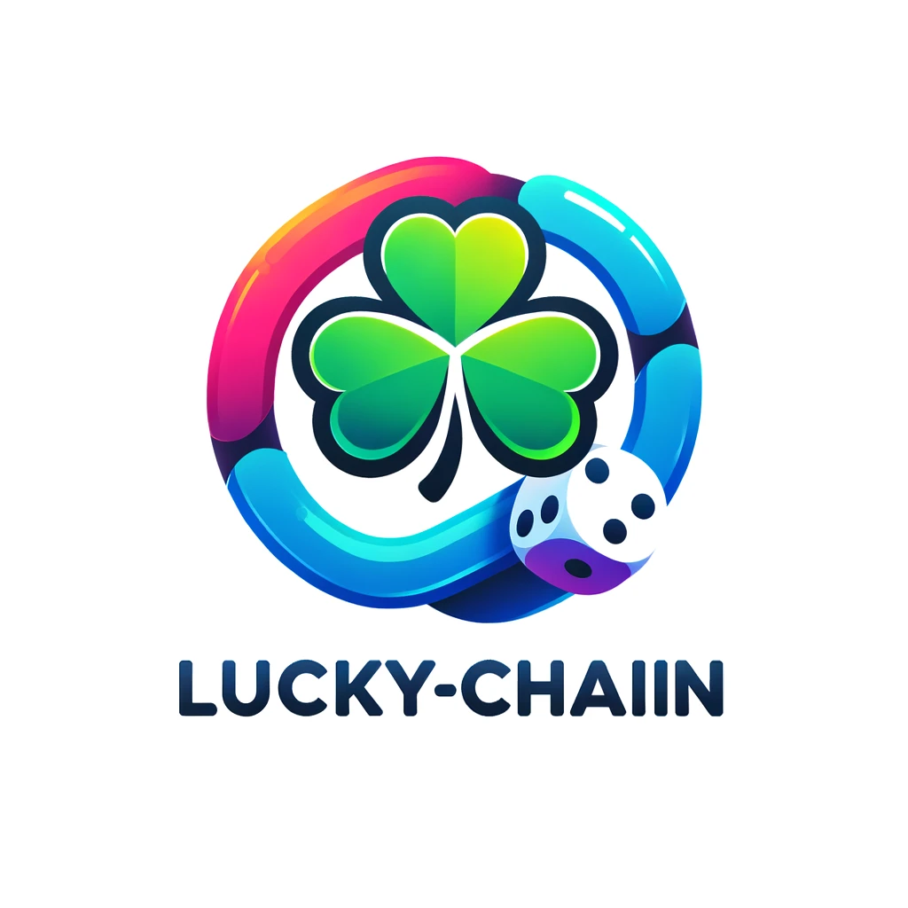

# Lucky-Chain

  

Lucky-Chain is a decentralized drawing assistant designed to ensure fairness in drawings by utilizing Chainlink's verifiable random functions (VRF). This project supports adding whitelisted participants, making it ideal for exclusive and fair drawings.

## Table of Contents

- [Lucky-Chain](#lucky-chain)
  - [Table of Contents](#table-of-contents)
  - [Introduction](#introduction)
  - [Features](#features)
  - [Getting Started](#getting-started)
    - [Prerequisites](#prerequisites)
    - [Installation](#installation)

## Introduction

Lucky-Chain leverages Chainlink's VRF to generate provably random numbers, ensuring the fairness and transparency of drawing events. By supporting whitelisted participants, it provides a secure and inclusive environment for exclusive drawings.

## Features

- **Fairness:** Utilizes Chainlink VRF for verifiable randomness.
- **Whitelist Support:** Allows adding specific participants to the whitelist.
- **Transparency:** Open-source and auditable smart contract.
- **Decentralization:** Runs on Ethereum, ensuring no single point of failure.
- **Security:** Built with secure and reliable smart contract practices.

## Getting Started

To get started with Lucky-Chain, follow these steps.

### Prerequisites
- Foundry

### Installation
Clone the repository and install dependencies:
- `git clone https://github.com/Web3-Future/lucky-chain.git`
- `cd contract`
- `forge install`